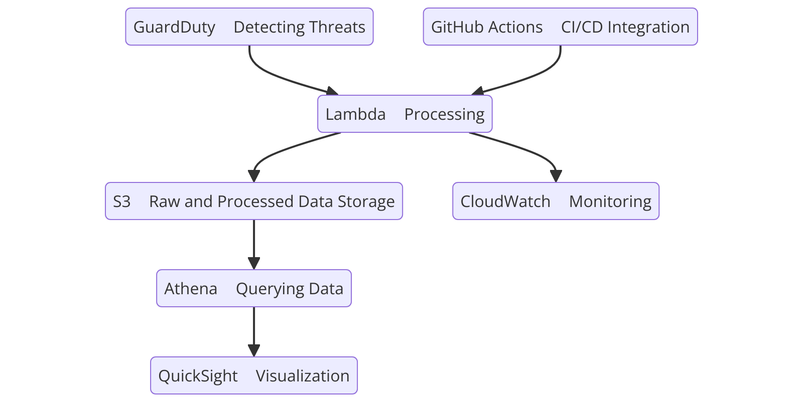

# AWS Security Monitoring Project

## Overview
The **AWS Security Monitoring Project** is designed to demonstrate the integration of AWS security services to detect, process, and visualize potential security threats in real-time. This project leverages AWS GuardDuty, Lambda, S3, Athena, and QuickSight to provide a comprehensive threat monitoring and visualization solution.

---

## Problem Statement
Organizations need robust security solutions to identify and respond to potential threats in their cloud environments. Manual threat detection is slow and error-prone, leading to delayed responses and increased risk.

This project automates threat detection and visualization, enabling faster decision-making and better security posture.

---

## Architecture
### High-Level Workflow
1. **Data Collection**: GuardDuty identifies security threats and exports findings to an S3 bucket.
2. **Data Processing**: Lambda functions process the findings and organize them in a structured format.
3. **Data Querying**: Athena queries the processed data from S3 for analysis.
4. **Data Visualization**: QuickSight visualizes the data, providing dashboards and insights.
5. **Monitoring**: CloudWatch tracks metrics and alarms for high-severity findings.
6. **CI/CD Integration**: GitHub Actions automates deployment and updates.

### Diagram


---

## Technologies Used
- **AWS GuardDuty**: Detects potential security threats.
- **AWS Lambda**: Processes and filters findings.
- **Amazon S3**: Stores processed findings.
- **Amazon Athena**: Queries the processed findings.
- **Amazon QuickSight**: Visualizes findings with dashboards.
- **Amazon CloudWatch**: Monitors metrics and triggers alarms.
- **GitHub Actions**: Implements CI/CD pipelines.
- **Terraform**: Manages infrastructure as code.

---

## Project Phases

### Phase 1: Data Collection
- **Service Used**: GuardDuty
- GuardDuty continuously monitors AWS accounts for threats and exports findings to an S3 bucket.

### Phase 2: Data Processing
- **Service Used**: AWS Lambda
- Lambda functions:
  - Filter findings to prevent recursive processing.
  - Process data and save structured JSON files to S3.

### Phase 3: Data Querying and Visualization
1. **Athena**:
   - Creates a database and table for querying GuardDuty findings stored in S3.
   - Executes queries to structure the data for QuickSight.

2. **QuickSight**:
   - Connects to Athena to fetch data.
   - Provides interactive dashboards for analyzing findings.

### Phase 4: Monitoring
- **CloudWatch**:
  - Monitors metrics such as `HighSeverityFindings`.
  - Triggers alarms and sends notifications using SNS.

### Phase 5: CI/CD Integration
- **GitHub Actions**:
  - Automates the deployment of Lambda, IAM roles, and S3 configurations.
  - Validates and applies Terraform configurations.

---

## Key Features
- Automated detection of security threats.
- Real-time visualization and analysis of findings.
- Alerting and monitoring for high-severity threats.
- Infrastructure as code with Terraform.
- CI/CD for seamless deployment and updates.

---

## Setup Instructions

### Prerequisites
- AWS Account with administrative privileges.
- Terraform installed on your local machine.
- GitHub repository for CI/CD integration.

### Steps

1. **Clone the Repository**:
   ```bash
   git clone https://github.com/your-repo/aws-security-monitoring.git
   cd aws-security-monitoring
   ```

2. **Configure AWS CLI**:
   ```bash
   aws configure
   ```

3. **Deploy Infrastructure**:
   ```bash
   terraform init
   terraform plan
   terraform apply
   ```

4. **Set Up QuickSight**:
   - Connect QuickSight to Athena.
   - Import the GuardDuty findings table.
   - Create dashboards and visualizations.

5. **Test the System**:
   - Simulate findings in GuardDuty.
   - Verify files are stored in S3 and visualized in QuickSight.

---

## Results
- Threat findings are visualized in an interactive QuickSight dashboard.
- Alarms are triggered for high-severity findings, enabling immediate action.
- Automated CI/CD pipelines ensure seamless infrastructure updates.

